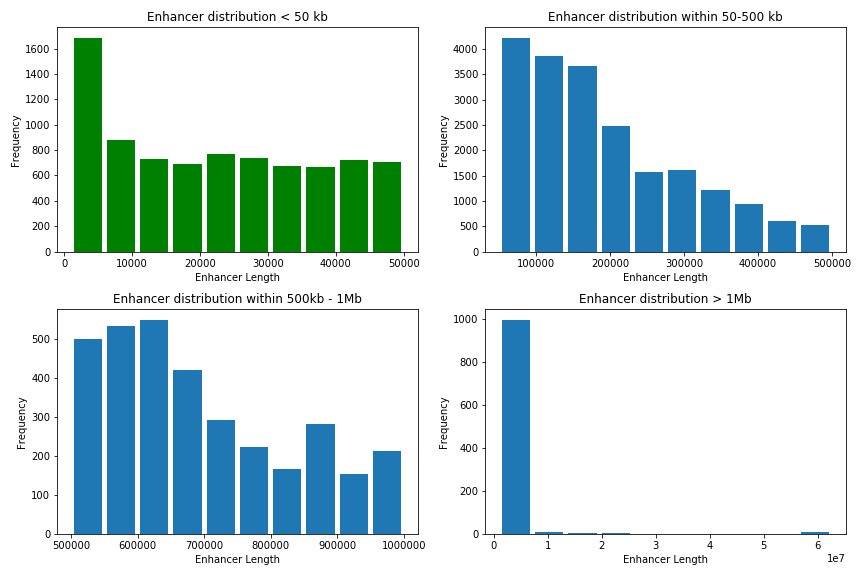
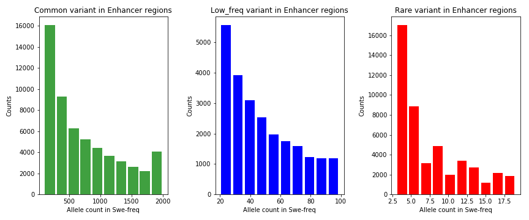

## Rare variant arthesclerosis

### Introduction

#### Arthesclerosis is a complex disease with complicated eitology 
#### Rare variants have been implicated in different complex studies. Modern genomics technology such as sequencing uncover unprecidented amount of data. 
#### Hicap and other technology connects the non functional regions with promoter and enhancer
#### n the current study we have used the rare variants from population study of swedish population. And observed the profile of rare and low frequency variants in interaction data from arthescloris patients. The goal was to annotate these promoter mediated enhaver regions with different funcitional marks and observe whethter there is enrichment of any of these DNA elements enriched in any of the regions

## Material and methods

### Data acquistion

Whole genome sequencing data was downloaded from swedgen frequency data (https://swegen-exac.nbis.se/downloads) of version 2. As reported these dataset includes the highest quality genetic map of swedish population From the resulting vcf file, the snp data set was created using a vcftools in order to seperate the snp and indel dataset. Additionally inforder to remove variants with less significance we removed. Following cmmand was used for the outputting the SNp and Indel files . Addiitonally I also removed the regions that was annotated as  dark region of genome fby Heing.et al. 

Annotation data from chipseq was used. I access the dataset dated on 30th september and download individual files from chipseq atlas and downloaded the chipseq peaks for H3Kmeth and H327Ac dataset as Histone modification markers and transcription factor binding sites for corresponding peaks. The main objective of this practise was to find the individual profile of each enhancer and calcuate the enrichment score of each datatset

### HI-CAP interactiome dataset

Preprocessing of interaction dataset would be required. However interaction data have their own pattern . Colums in interaction...

### Defination of Rare and low frequncy variant in the population

The variants from the swedish ppluation was classified into theree seperate catogories i.e Rare, Low frequncy and common based on the allele frequncy in the population THe variant classification were on the frequency  such that variant with MAF>0.05 were classified as "Common", Low frequency with  0.05 < MAF < 0.01, Rare variants < 0.01. However in the rare frequncy variants wer have removed that private variants that were present within one individual either in homozygous or heterozygous condition. 

### Python script

Customized python script was developed for each tasks and following this a pipleline scheme of these scripts were run in both low frequency and rare varaints .

### GO TERM Enrichment analysis

GO term included the moelcular biological and cellular processes that were curated from the GO_database. We download GO-terms from queick go database . Additionally while downloading the date we considered only the terms that were fullfilled the criteria of ... given in the database. We used this criteria in order to limit or gene pntology analysis to relatively functional genes which have the experimental validation. A customized python was made in for the following analysis as well.

## Results

### Number of Rare, Common and low frequency alleles in Swedgen population and number in the enhancer region of genome

Orignally there was 35million variants thate were tagged as "Pass" all 1000 swedish genome population.  1462754 indel variants were identified as the passed on GATK filter. As shown in Fig 1. we have identified XXXX SNPs and 4,459,773 indels in in the population. 

  The preprocessed promoter-enhancer list was contained 33,323 unique enhancers regions in Bicuspid aortic valve (BAV cells. The data contains of promoter regions and corresponding enhancer regions of 2 replicates from BAV cell. We found on average of 20.38 and 13.93 interaction enhacers change in replicate1 and replicate2 respectivley. As shown in figure 1, we identified  distribution of different enhancer length. 
  
  
  
-------------------------------------------------------------
    Enhancer_length                     Counts
-------------------------------------------------------------
        < 50kb                          8259  
        50-500kb                        20700
        500kb -1Mb                      3334
        > 1MB                           1030 
-------------------------------------------------------------

This length distribution depicts that most of our putative enhancers are within the range of 50-1Mb base pairs which is in par with the Hi-C methods

We identified  22,055, 14403 and 22,144 putative enhancer regions in our interaction dataset with common, low-frequency and rare variants. Furthermore, we identified in total 56,891 common , 24,049 low-frequency and  47,281 rare variants enriched in these enhancer regions as shown in table 2. Interestinly, our enhancer regions have been enriched with rare variants from the population.

| Variant class     | Enhancer with variants | Total variants type |
| :---         |     :---:      |          ---: |
| Common   | 22055     | 56891    |
| Low Frequency     | 14403      | 24049     |
| Rare    | 22144       | 47281      |

Furthermore, we observed high enrichment of rare varaints  as shown in Figure 2 with allele count lesser than 5 count in the population. This tells us that most of our variants are present in very low frequency within the population.

### Status of non coding functional elememts of varaints embedded enhancer regions

We observed the following non coding functional elements in each of three seperated annotated dataset table 2 and figure 2

|class    |at_least_one   |DNS   |HM   |TFs   |DNS+HM   |DNS+TFs   |HM+TFs   |ALL   |
|:---|:---||:---|:---:|:---:|:---:|:---:|:---:|:---:|---:|	
|Common|5087|3350|3029|3416|2042|2487|1744|1565|
|Low Frequency|3407|2276|2038|2356|1393|1736|1229|1095|
|Rare|5178|3440|3097|3524|2114|2587|1820|1638|

From the above chart, it can been said that we have at least one of functional markers in about (5087/22055) 23% of putative enhacer in all classes of variants. However, it has to be considered that we took into consideration one of cellline and these are the markers specific to cell type. Most intersting , we still find at least 1000 putatively, functional enhancers in all classes in all. It would be interesting to see these functional enhancer regions and dig into Rare and Low frequency varaints in these region. More intersting, it would be interesting if any of these varaints are earlier implicated in any arthesceloris heart diseases. Furthermore, these are result only from overlpaaing with one dataset. This data has to be randomized and overlapped so as to find the putative p-values to our non coding functional elements.

### GO term enrichment status of P_E  interaction mediated genes

We found 2 enriched GO Terms at descending order of enhancer per gene and number of enhancer mediated_promoter gene > 2 in rare and Low frequency variants i.e  GO:1902894  regulation of pri-miRNA transcription from RNA polymerase II promoter GO:1901509 regulation of endothelial tube morphogenesis. 

### Discussion

High enrichment of rare variants in putative enhancer with allele count less than 5 

Based on the defination of different enhancer such as  H327ac and H3Kme1 we didnt found high enrichment, it might be as we only looked into one type of cell type which doesn't matched the real primary cell type.